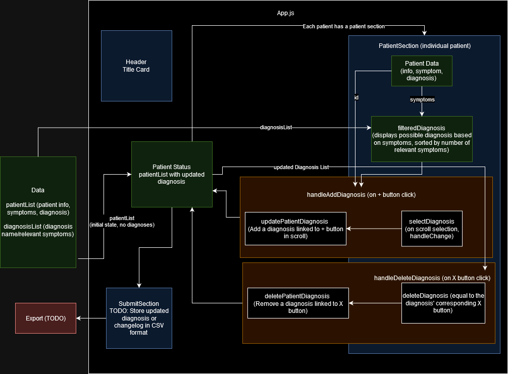

# NEMS Coding Project

## Website Link
https://main.d3otgbi377lksu.amplifyapp.com/
## Instructions
- Patient Demographics
    - Name
    - Age
    - Address
    - Sex/Gender
- List of recommended diagnosis to choose from
    - Implement some sort functionality without using built in features (client side/server side)
- User interaction to add diagnosis to patient
    - save to a file, database, or in-memory so that a page refresh keeps the state of that change
- If you can put yourself in the shoes of a doctor treating a patient what additional feature might be useful and how would you go about extending the application to support those.

## Ideas

- Extending to recommended medication
- Better sorting algorithm (maybe rank the symptoms of how likely they predict a diagnosis)

## TODO:
- Add submit function to export current data
- Styling
